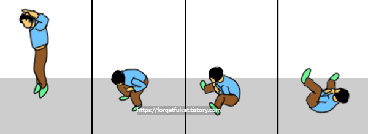
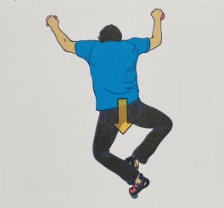

# 클라이밍 강습 정리

## 1. OT & 안전

### 낙법

- 무게중심을 낮춘 상태에서 위로 점프하면서 내려온다
- 내려온 후 무릎을 굽히면서 뒤로 구른다
- 목이 다치지 않도록 목에 힘을 준다
- 손이 다치지 않도록 손을 가슴으로 모아준다

### 쵸크
- 손에 땀이 나는 것을 대비하여 바른다

---

## 2. 인사이드

### 기본 개념

- 발을 반으로 나누었을 때 **엄지발가락 방향**을 사용하는 것이 인사이드
- 반대를 사용하는 것이 아웃사이드
- 엄지발가락을 홀드에 두고 지지한다
- 진행방향에 발 홀드가 있을 때 사용한다

### 동작 순서
1. **체중이동**
2. **손 이동**
3. **발 정리** (발발)
4. **나머지 손** 따라오면서 기본자세로 복귀

> 순서: 체중이동 → 손 → 발발 → 손 → 정리

### 체중이동 & 발 정리
- 체중이동 시 진행방향 **반대쪽 발**을 밀어준다
- 발 정리 시 **무게중심이 실려있지 않은 발**부터 이동한다
- 체중이동을 많이하면 멀리 갈 수 있지만, **필요한 만큼만** 가는 것이 좋다

### 유연성 향상 동작

- 양 발바닥을 모은 상태에서 몸으로 끌어당겨 상체를 숙이는 동작 반복

### 추가 팁
- **팔을 피는 이유**: 팔에 들어가는 힘을 줄이기 위함
- **벽 밀착의 중요성**: 벽에 밀착할수록 힘이 덜 들어감
  - 밀착하지 않으면 아래로 가는 힘 + 밖으로 나가려는 힘을 동시에 통제해야 함
- **벽 밀착 방법**: 발 각도를 밖으로 틀고, 무릎도 밖으로 회전시킨다

---

## 3. 발바꾸기 & 벽딛기

### 발바꾸기

1. 팔을 핀 상태에서 발을 바꿀 수 있는 공간을 확보한다
2. 홀드에서 떨어져야 하는 발을 비틀어서 홀드로 올 발을 위한 공간을 만든다
3. 홀드로 오는 발은 **지면과 수직**, **복숭아뼈가 벽과 평행**이 되도록 홀드에 있는 발 끝부분으로 이동한다
4. 홀드에서 한 발을 떼고 홀드로 이동한 발을 정리한다
5. 홀드에 있던 발도 다른 홀드나 벽으로 이동해서 중심을 잡는다

### 벽딛기
- 벽을 딛을 때는 **벽과 수직**이 되도록 지지한다
- 벽은 홀드보다 미끄럽기 때문에 미끄러지지 않는 위치 선택이 중요
  - 팔을 핀 상태에서 앉았을 때 **무릎 정도 위치**가 일반적
- 다음 홀드가 오른쪽에 있더라도 발을 찰 때는 **수직으로 차고 끝까지** 차준다
  - 끝까지 찬다 = 차고 나서 무릎이 굽혀지지 않는 것
- 발을 차고 수직으로 나온 에너지를 이용해서 다음 홀드를 잡는다
  - 손을 지지하고 있으므로 직선 운동이 원심력으로 변경되어 다음 홀드로 이동 가능
- 평소보다 벽에서 수직으로 나오는 힘이 강해지므로 **손에 부담이 더 들어간다**

---

## 4. 그립 & 루트파인딩

### 그립

#### 저그홀드
- 가장 기초적인 홀드로 안에 손가락을 넣을 수 있는 홈이 있다
- 홈이 얼마나 들어가 있는지를 'deep in'으로 표현한다
- 손을 말듯이 잡고 엄지 손가락을 밀어준다는 생각으로 홀드를 잡는다

#### 핀치홀드
- 집게 모양처럼 손을 잡아야 하는 홀드
- 책을 꺼낼 때처럼 꼬집듯이 잡는다
- 엄지손가락의 위치는 중지와 검지 사이의 반대편 정도로 한다
- 엄지손가락을 제외한 나머지 손가락은 모아준다

#### 포켓홀드
- 구멍이 있어 손가락을 넣어서 잡아야 하는 홀드
- 두 손가락을 넣어야 하면 검지 중지, 혹은 중지 약지를 이용한다
- 나머지 손가락은 모아준다
- 위험하므로 안될 것 같으면 바로 내려오는 게 좋다

#### 크림프
- 손가락 마디가 들어갈 정도로만 나와있는 홀드
- 손가락을 최대한 넣을 수 있을 만큼 넣는다
- 눌러서 지지한다
- 팔과 손가락을 수직이 되도록 위치하고 지지한다
- **그립 종류**
  - **오픈 그립**: 손가락으로만 지지한다
  - **하프 그립**: 손가락을 손과 수직이 되도록 지지한다. 엄지 손가락으로 보조한다
  - **풀 그립**: 손가락을 눌러 잡고 엄지 손가락으로 검지를 감싼다. 진짜 필요할 때만 쓰고 사용 안하는 게 좋다. 손가락 변형이 올 수 있다

#### 슬로퍼
- 홈이 파져있지 않은 홀드
- 엄지손가락을 제외한 나머지 손가락을 모아준다
- 접촉 면적을 최대한 높여서 홀드를 잡는다
- 손가락과 팔을 수직이 되도록 유지한다
- 무게 중심이 홀드 아래 위치하도록 특히 신경쓴다

#### 언더그립
- 홈이 아래 있는 홀드
- 팔을 내린 상태로 쭉 펴서 홀드를 잡는다

### 루트파인딩
- 팔과 발, 무게 중심 중 **팔 홀드를 중점적으로** 본다
- 팔 홀드가 틀어진 정도, 얼마만큼 간격이 벌어졌는지, 홀드 종류가 어떤 종류인지를 확인한다
- 어떤 홀드들이 있는지 올라가면 잘 안보이기 때문에 **위치를 모두 확인**하는 것이 좋다
- 한 동작을 생각할 때는 **다음 동작까지 고려**해서 생각하는 것이 좋다

---

## 5. 아웃사이드

### 기본 개념
- 발을 반으로 나누었을 때 **중지 기준으로 바깥 방향**을 사용하는 것이 아웃사이드
- **가운데 발가락(중지)과 약지 발가락**을 사용해서 홀드를 지지한다
- 인사이드와 달리 아웃사이드는 **방향성**이 존재한다

### 사용 시기
1. **진행방향에 발홀드가 없을 때**
2. **홀드를 그립할 때 사이드로 잡는 경우**

### 방향성 이해
- **왼쪽 아웃사이드**: 오른쪽으로 진행하기 위해 왼쪽을 바라본 자세
- **오른쪽 아웃사이드**: 왼쪽으로 진행하기 위해 오른쪽을 바라본 자세
- 진행방향과 시선 방향이 반대인 것이 특징

### 자세
- **몸을 사이드로 완전히 튼다** (허리를 벽 방향으로 비틀기)
- **시선도 튼 방향을 바라본다**
- 발의 바깥쪽 엣지로 홀드를 디딘다

### 장점
- **인사이드에 비해 몸을 벽에 더 붙일 수 있다**
  - 허리를 벽에 가깝게 붙이는 것이 가능
  - 힘이 비교적 덜 들어간다
- **회전력을 활용**하여 팔힘을 절약할 수 있다
- **등근육을 사용**하기 때문에 팔의 부족한 힘을 보완할 수 있다
- 특히 **오버행 벽에서 유용**하게 쓰인다

---

## 6. 볼륨 딛기

### 볼륨이란?
- **홀드와 다르게 벽과 같은 나무 재질**로 되어 있다
- **벽을 대신하기 위해** 만들어진 것
- **평평한 면이 존재**하는 것이 특징
- 벽 대용이므로 **볼륨에는 홀드가 붙어 있을 수 있다**

### 기본 딛기 방법
- 그냥 딛게 되면 **미끄러워 지탱이 잘 안된다**
- 벽을 딛을 때처럼 **수직으로 누르는 힘**을 주어야 한다

### 발 사용법
- **홀드 vs 볼륨**
  - 홀드: 발가락으로만 지지
  - 볼륨: 발가락을 이용하되 **발을 낮춰서 접촉 면적을 높인다**
- **발쪽에 힘을 주어 누른다**
  - 미끄럽다고 손에 힘을 주는 것보다 발쪽에 힘을 주는 것이 좋다
  - 접촉면의 마찰을 높이기 위함

### 슬랩에서의 볼륨 딛기
- **볼륨의 끝부분 쪽을 밟는 것이 좋다**
  - 각도를 만들어서 손홀드가 불안정하거나 없더라도 중심을 벽에 기대서 잡을 수 있다
- **주의사항**: 너무 끝쪽을 밟으면 접촉면적이 적어진다
  - **접촉면적이 보존된 상태**에서 최대한 끝쪽을 밟아야 한다

---

## 7. 데드포인트

### 기본 개념
- **다이나믹 클라이밍의 기초 기술**
- 중력과 힘이 균형을 이루는 순간, 즉 **무중력 상태**를 활용하는 기술
- 전신의 근육을 이용해서 찰나의 짧은 순간을 만들어낸다
- 바이킹을 탈 때 고점에서 멈춘 것처럼 몸이 붕 뜨는 순간을 이용

### 다이노와의 차이
- **데드포인트**: 한 발 또는 양발이 홀드에 **남아있는 상태**에서 무중력 순간을 이용
- **다이노**: 발이 홀드에서 **완전히 떨어지는** 점프 동작으로 부상 위험이 더 크다

### 동작 순서
1. **몸의 긴장을 풀어준다**
2. **골반을 뒤로 뺀다**
   - 상체를 아래가 아닌 뒤로 빼서 반동을 만든다
3. **골반을 벽에 붙이는 동시에 팔을 당긴다**
   - 순간적으로 강하게 힘을 주어야 한다 (천천히 X)
   - 하체의 힘으로 일어서면서 전신을 이용한다
4. **벽과 밀착하기 전 70% 정도 상태에서 팔을 뻗는다**
   - 무중력 순간을 포착하여 팔을 뻗는다
5. **다음 홀드를 잡는다**
6. **발을 정리한다**

### 주의점
1. **생각보다 강한 힘으로 벽에 다가가야 한다**
   - 팔의 힘을 최소화하고 **하체의 힘**을 사용한다
   - 골반을 벽쪽으로 넣으면 무게중심이 벽 안쪽으로 붙어 체공시간이 길어진다

2. **타이밍이 중요하다**
   - 팔을 늦게 뻗거나 빨리 뻗지 않는다
   - 특히 초보자는 팔을 먼저 뻗는 경우가 있는데, 몸이 충분히 붙지 않은 상태에서 팔을 뻗으면 홀드를 잡더라도 흔들림이 강해진다

3. **팔을 당길 때는 순간적으로 강하게**
   - 천천히가 아닌 순간적으로 강하게 힘을 주어야 한다

### 사용 시기
1. **홀드가 멀리 있을 때**
   - 하체의 힘으로 무중력 상태를 만들어 위로 나아가기 쉬워진다
2. **오버행에서 힘을 절약하기 위해서**
   - 고난이도 문제로 갈수록 사용하기 좋은 필수 기술

### 연습 방법
1. **체공시간을 늘리는 연습**
   - 벽에 붙어있는 체공시간을 늘리는 연습을 한다
   - 체공시간 중에 손이 자유로워지므로 박수를 치는 연습도 좋다

2. **벽으로 붙는다는 느낌**
   - 진행방향으로 간다는 느낌보다 **벽으로 붙는다**는 느낌이 더 중요하다

3. **인사이드부터 시작**
   - 처음에는 인사이드를 사용하는 것이 더 쉽다
   - 인사이드가 익으면 아웃사이드를 사용해서 연습한다

4. **나쁜 홀드에서의 연습**
   - 그립의 틀어짐을 방지하기 위해 하체는 고정시킨 후 상체를 뒤로 뺀 다음 약한 반동을 만든다

5. **반복 연습의 중요성**
   - 루트를 오르면서 동시에 연습하기보다는
   - 일반 벽에서 충분히 연습한 상태에서 활용하는 것이 좋다

### 활용
- **다이노**, **코디네이션** 같은 동작의 기본이 된다
- 데드포인트를 마스터하면 더 다이나믹한 기술로 발전 가능

---

## 8. 인사이드 오버행

### 기본 개념
- **인사이드 스텝**과 **데드포인트**를 동시에 활용하는 기술
- 오버행 벽에서는 벽과의 거리 × 몸의 무게에 비례하여 팔에 힘이 가해진다
- 인사이드는 일반적으로 **수직 벽에서 더 유용**하지만, 데드포인트와 결합하면 오버행에서도 효과적으로 사용 가능

### 오버행에서의 특징
- **오버행에서는 팔을 굽히는 동작에 힘이 많이 필요하다**
  - 중력 방향과 벽의 각도로 인해 팔에 걸리는 부하가 크다
  - 팔을 접으면서 천천히 이동하면 팔 근육에 지속적인 부담이 간다

### 동작 방법
1. **인사이드 자세로 체중이동**
   - 엄지발가락 방향을 사용하여 홀드를 밟는다
   - 무릎을 밖으로 틀어서 벽에 최대한 붙는다

2. **데드포인트 동작 수행**
   - 골반을 뒤로 뺐다가 벽에 붙이는 동시에 팔을 당긴다
   - 하체의 힘을 이용해서 순간적으로 강하게 힘을 준다
   - **무중력 순간**을 포착하여 팔을 뻗어 다음 홀드를 잡는다

3. **발 정리**
   - 홀드를 잡은 후 발을 정리하여 안정적인 자세를 유지한다

### 힘 절약의 원리
- **팔 힘 의존도 감소**
  - 데드포인트를 사용하지 않고 팔을 접으면서 이동하면 팔 근육이 지속적으로 수축해야 함
  - 데드포인트를 사용하면 하체의 힘으로 순간적으로 무중력 상태를 만들어 팔 힘 절약

- **체공시간 활용**
  - 무중력 순간에는 팔에 걸리는 부하가 최소화된다
  - 이 짧은 순간을 이용해서 다음 홀드로 이동

### 주의점
1. **충분한 힘으로 데드포인트 수행**
   - 오버행에서는 생각보다 강한 힘으로 벽에 다가가야 한다
   - 골반을 벽쪽으로 충분히 넣어서 무게중심을 벽 안쪽으로 붙인다

2. **타이밍이 중요**
   - 벽과 밀착하기 전 70% 정도 상태에서 팔을 뻗는다
   - 너무 일찍 뻗으면 홀드를 잡더라도 흔들림이 심해진다

3. **코어의 중요성**
   - 오버행에서는 코어가 단단히 받쳐주지 않으면 팔다리를 함께 이용하기 어렵다
   - 평소 코어 운동을 통해 체간을 단단하게 만드는 것이 중요

### 사용 시기
1. **오버행 벽에서 홀드 간 거리가 멀 때**
   - 팔만으로는 도달하기 어려운 홀드를 잡을 때

2. **팔 힘을 절약하고 싶을 때**
   - 힘이 충분하다면 팔을 접으면서 이동할 수도 있지만
   - 고난이도 문제일수록 힘을 절약하는 것이 중요

3. **진행방향에 발 홀드가 있을 때**
   - 인사이드 자세를 취할 수 있는 상황에서 데드포인트를 결합

### 연습 팁
- 데드포인트가 충분히 익숙해진 후 연습하는 것이 좋다 (7. 데드포인트 섹션 참고)
- 처음에는 약한 오버행부터 시작하여 점차 각도를 높여간다
- 하체의 힘으로 벽에 붙는다는 느낌을 중점적으로 연습

---

## 9. 아웃사이드 오버행

### 기본 개념
- **아웃사이드 스텝**과 **데드포인트**를 결합한 기술
- 인사이드 오버행보다 **힘이 덜 드는 자세**로, 오버행에서의 체력 절약에 효과적
- 아웃사이드 자세를 취하면 허리를 벽에 더 붙일 수 있어 팔에 가해지는 부하를 줄일 수 있다

### 출발 자세
- **팔을 늘어뜨린 편한 자세**에서 출발한다
  - 팔에 불필요한 힘이 들어가지 않도록 한다
  - 이 자세를 **릴리즈 자세**라고 하며, 반동을 만드는 기점이 된다

### 동작 방법

#### 아웃사이드 자세가 유지되는 경우
1. 릴리즈 자세에서 아웃사이드 자세를 만든다
2. **무릎을 안쪽으로 꺾어** 아웃사이드 자세를 취한다
3. 바로 데드포인트 동작으로 연결하여 다음 홀드를 잡는다

#### 아웃사이드 자세 유지가 어려운 경우 (좌우 반동 활용)
1. 릴리즈 자세에서 **좌우 반동**을 만든다
   - 원심력을 이용하여 반동을 주는 것이 핵심
2. 반동의 정점에서 **무릎을 안쪽으로 꺾으면서** 순간적으로 아웃사이드 자세를 만든다
3. 이 순간을 이용하여 데드포인트로 다음 홀드를 잡는다

### 발 사용의 핵심
- **꺾는 쪽의 발**: 무릎을 안쪽으로 꺾으면서 발도 함께 틀어준다
  - 발의 바깥쪽 엣지로 홀드를 디디는 아웃사이드 자세가 완성된다
  - 무릎이 안쪽을 향하면서 골반이 벽쪽으로 자연스럽게 붙는다
- **반대발**: 힘을 주어 적극적으로 밀어준다
  - 반대발을 벽에 밀착시켜 균형을 잡는 레버 역할을 한다
  - 이것이 '바나나 도어(barn door)' 현상(몸이 벽에서 떨어져 회전하는 것)을 방지한다

### 힘 절약의 원리
- **허리의 벽 밀착**
  - 아웃사이드 자세를 취하면 허리가 벽에 더 붙을 수 있다
  - 무게중심이 벽 안쪽으로 이동하여 팔에 가해지는 부하가 줄어든다
- **원심력 활용**
  - 릴리즈 자세에서 만든 반동의 원심력을 이용해 힘을 아낀다
  - 팔 힘이 아닌 몸 전체의 운동에너지를 이용한다
- **인사이드 오버행과의 비교**
  - 인사이드 오버행은 몸이 벽에서 멀어지기 쉬워 팔 부하가 크다
  - 아웃사이드 오버행은 허리를 더 붙일 수 있어 **팔 힘을 더 절약**할 수 있다

### 주의점
1. **코어 긴장 유지**
   - 오버행에서는 코어를 단단히 유지하지 않으면 팔다리를 연동하기 어렵다
   - 반동을 만들 때도 코어의 안정성이 전제되어야 한다

2. **반동 타이밍**
   - 반동의 정점에서 무릎을 꺾어야 한다
   - 타이밍을 놓치면 아웃사이드 자세가 만들어지지 않는다

3. **팔 자세**
   - 데드포인트 이전까지 팔을 최대한 펴서 팔 근육의 피로를 줄인다

### 인사이드 오버행과의 비교

| 구분 | 인사이드 오버행 | 아웃사이드 오버행 |
|------|----------------|-----------------|
| 발 엣지 | 엄지발가락 방향 (인사이드) | 새끼발가락 방향 (아웃사이드) |
| 무릎 방향 | 밖으로 | 안쪽으로 |
| 허리 밀착 | 상대적으로 낮음 | 상대적으로 높음 |
| 팔 부하 | 상대적으로 높음 | 상대적으로 낮음 |
| 발홀드 위치 | 진행방향에 있을 때 유리 | 사이드에 있을 때 유리 |

### 사용 시기
1. **오버행에서 사이드에 발홀드가 있을 때**
2. **아웃사이드 자세를 취할 수 있는 상황에서 데드포인트를 연결할 때**
3. **힘을 최대한 절약해야 하는 고난이도 문제에서**

### 연습 팁
- 인사이드 오버행과 데드포인트가 충분히 익숙해진 후 연습하는 것이 좋다
- 먼저 아웃사이드 자세가 유지되는 상황에서 데드포인트를 연결하는 연습부터 시작한다
- 이후 좌우 반동을 이용해 순간적으로 아웃사이드 자세를 만드는 연습으로 발전시킨다

---

## 10. 하이스텝

### 기본 개념
- 무릎을 굽히지 않고 서있을 때 기준으로 **무릎보다 위에 있는 홀드**를 밟고 진행하는 기술
- 단순히 발을 높이 올리는 것이 아니라, **무게중심을 그 발 위로 완전히 이동**시켜 팔의 부담을 줄이는 것이 핵심
- 인사이드(프론트 하이스텝) 상황에서 주로 사용된다

### 동작 방법

#### 기본 하이스텝
1. 목표 홀드를 확인하고 발끝을 홀드에 정확히 올린다
2. 무게중심을 하이스텝한 발쪽으로 **완전히** 넘긴다
   - 골반을 하이스텝한 발의 발목 위로 이동시킨다
   - 벽에 최대한 가깝게 붙는다
3. 팔로 당기지 않고 **다리 힘으로 일어서면서** 다음 홀드를 잡는다

#### 응용: 데드포인트와 결합 (홀드가 멀리 있는 경우)
1. 릴리즈 자세(팔을 편 상태)에서 시작한다
2. 반동을 이용해 무게중심을 하이스텝한 발쪽으로 넘긴다
3. 하이스텝한 발을 강하게 차면서 데드포인트를 만든다
4. 무중력 순간에 다음 홀드를 잡는다

### 무게중심 이동의 중요성
- 무게중심이 하이스텝한 발 위로 오지 않으면 **팔에 부담이 집중**된다
- 무게중심이 넘어간 상태에서는 하체 힘만으로 다음 홀드까지 도달할 수 있다
- 팔을 당기는 것이 아닌 **발로 밀어 올라간다**는 느낌이 중요하다

### 발 사용 주의점
- **홀드가 안좋은 경우가 많다** (작은 홀드, 미끄러운 홀드 등)
  - 발끝을 정확히 홀드에 올려야 한다
  - 발바닥 아치(중간 부분)가 아닌 **발끝 엣지**로 지지한다
  - 접촉면의 마찰력을 최대한 활용한다
- 무게중심이 넘어가기 전까지 발이 미끄러지지 않도록 **발에 집중**한다

### 인사이드 하이스텝의 장점
- 무게중심을 안정적으로 올릴 수 있다
- 허리를 벽에 붙이는 것이 상대적으로 용이하다
- 손홀드 컨트롤이 더 안정적이다
- **먼 홀드를 잡아야 할 때** 무게중심을 완전히 이동시킨 상태에서 팔 부담을 최소화할 수 있다

### 주의점
1. **무게중심을 완전히 이동하지 않는 실수**
   - 두려움이나 불안함으로 인해 무게중심을 하이스텝 발 위로 충분히 넘기지 않는 경우
   - 결과적으로 팔에 힘이 집중되어 금방 지친다

2. **팔로 당기려는 실수**
   - 팔의 힘으로 올라가려 하면 체력 소모가 크다
   - 다리 힘으로 밀어 올라가는 것이 올바른 동작

3. **골반 유연성 부족**
   - 하이스텝은 고관절과 햄스트링 유연성이 필요하다
   - 유연성이 부족하면 무게중심을 충분히 넘기기 어렵고 자세가 불안정해진다
   - 평소 나비 스트레칭 등 고관절 유연성 운동을 병행하는 것이 좋다

### 사용 시기
1. **홀드가 무릎보다 높은 위치에 있을 때**
2. **팔 힘을 절약하고 하체 힘을 적극 활용하고 싶을 때**
3. **슬랩이나 수직 벽에서 높은 발홀드를 사용할 때**

---

## 11. 푸쉬
*(진행 중)*

---

## 12. 힐훅 & 토훅
*(진행 중)*
                    