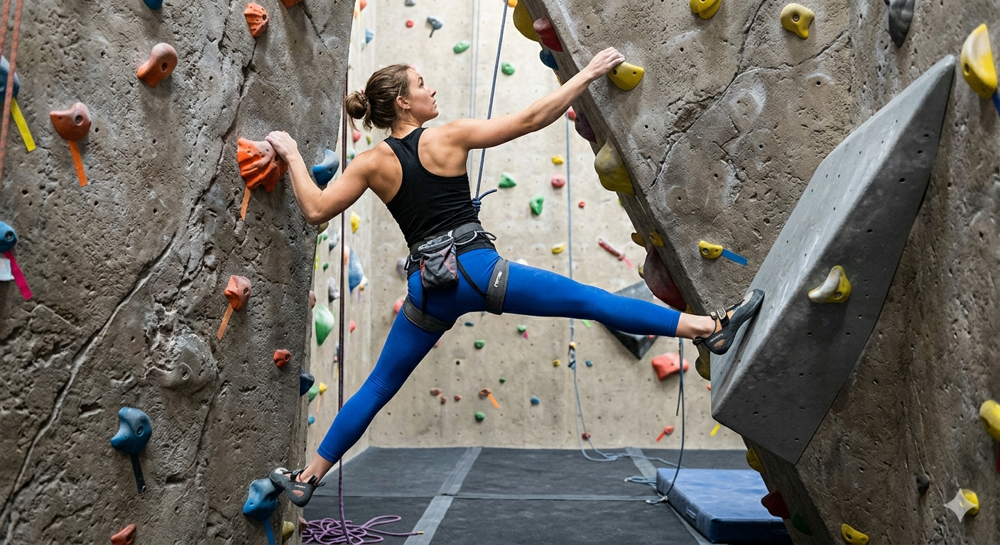
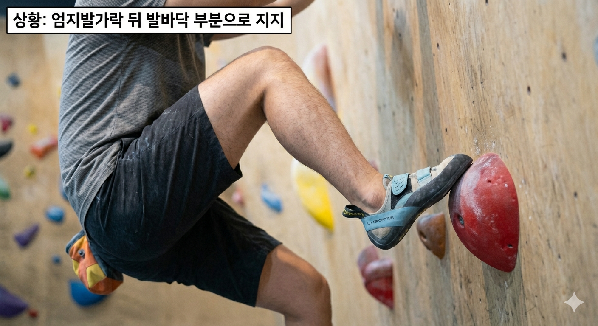
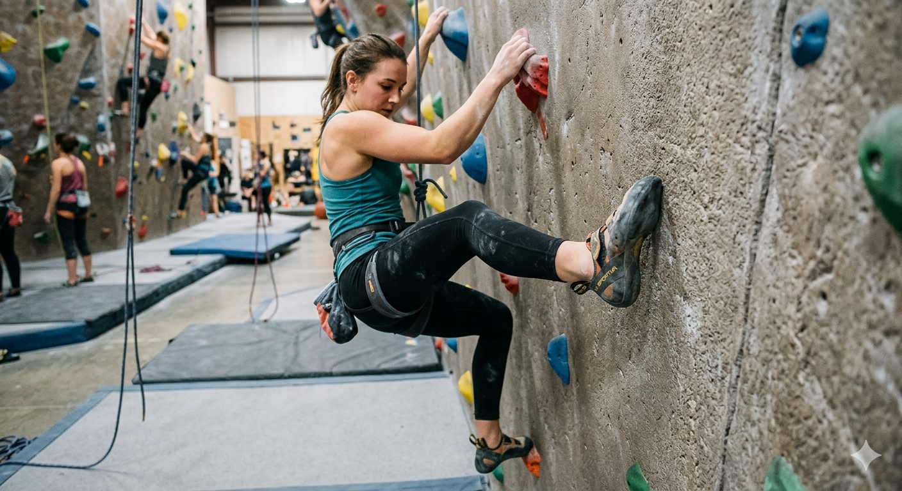
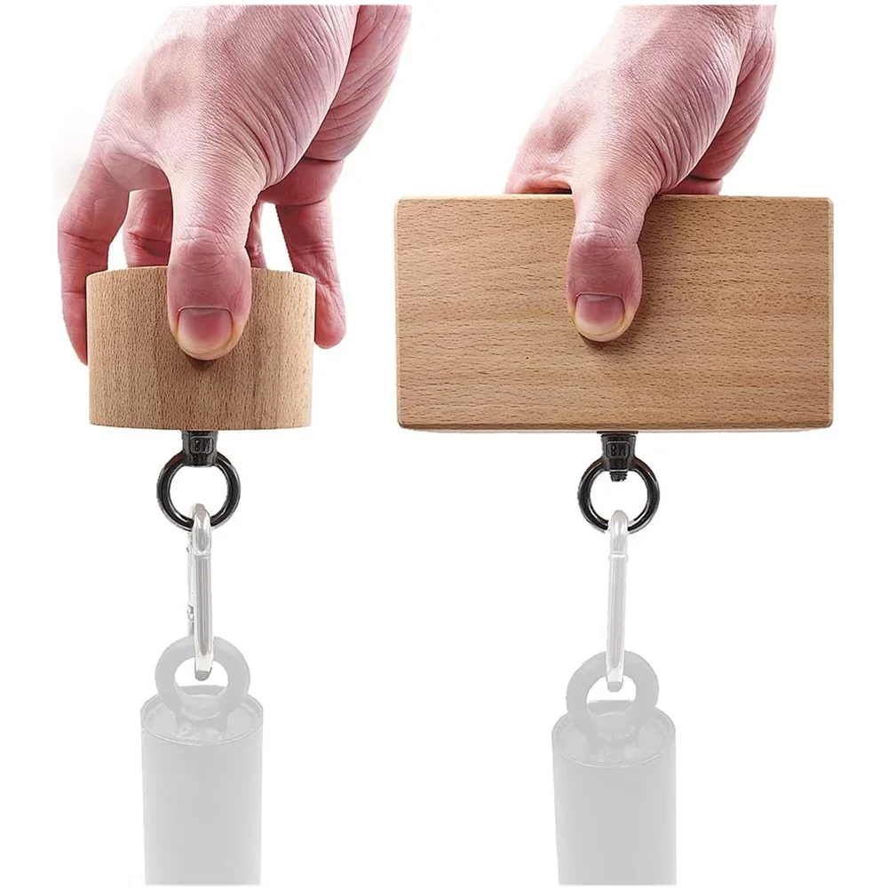

# 클라이밍 강습 정리 — 레벨업반

## 1. 풋워크 심화

### 1-1. 밀어딛기

다음 홀드로 진행할 때 무게중심을 이동해야 하지만, 발홀드가 기울어져 있어서 중심을 이동하면 발이 미끄러지는 상황에서 사용하는 기술이다.

- **방법**: 무릎을 편 상태로 발을 밀면서 발등을 아래로 내려 지지한다
- **핵심**: 무게중심 이동 없이 발을 밀어내는 힘으로 지지력을 확보한다
- **상황**: 발홀드가 경사져 있거나 마찰이 부족한 경우에 활용

### 1-2. 당겨딛기

무게중심을 이동해서 다음 홀드로 진행해야 하지만, 홀드가 너무 작아 무게중심 이동이 어려운 상황에서 사용하는 기술이다. 힐훅을 걸어 이동해야 하지만 힐훅을 걸기 애매한 상황에서 힐훅 대용으로 활용할 수 있다.

- **방법**: 엄지발가락 뒷부분으로 홀드를 지지한 뒤, 데드포인트를 이용해 반동으로 무게중심을 이동하면서 엄지발가락으로 전환한다
- **핵심**: 힐훅 대용 기술로, 엄지발가락 뒷부분 → 엄지발가락으로의 전환이 핵심이다
- **상황**: 홀드가 작아 무게중심 이동이 어렵거나, 힐훅을 걸기 애매한 경우에 활용

### 1-3. 스미어링

발이 미끄러지지 않도록 홀드를 지지하기 위한 기술이다. 손을 편 상태로 발쪽에 체중을 실어, 미끄러질 우려가 있는 홀드에 발을 비비면서 클라이밍 슈즈의 고무가 열을 받아 홀드에 더 강력하게 접지되도록 한다.

- **방법**: 손을 펴고 발에 체중을 실으면서 홀드 표면에 발을 비벼 마찰열로 접지력을 높인다
- **핵심**: 고무가 열을 받으면 홀드에 더 강하게 달라붙는 원리를 활용한다
- **상황**: 볼륨홀드에서 주로 사용하며, 일반 홀드에서도 미끄러운 경우 활용 가능

---

## 2. 다이나믹 인&아웃

> 초급반 8. 인사이드 오버행, 9. 아웃사이드 오버행과 동일한 내용이다.

오버행 벽에서 **인사이드/아웃사이드 스텝**과 **데드포인트**를 결합하여 동적으로 이동하는 기술이다. 오버행에서는 벽과의 거리 × 몸의 무게에 비례하여 팔에 힘이 가해지므로, 데드포인트를 활용해 무중력 순간을 만들어 팔 힘을 절약하는 것이 핵심이다.

### 2-1. 다이나믹 인사이드

인사이드 스텝과 데드포인트를 동시에 활용하는 기술이다.

- **방법**: 엄지발가락 방향으로 홀드를 밟고, 무릎을 밖으로 틀어 벽에 최대한 붙인 뒤, 골반을 뒤로 뺐다가 벽에 붙이는 동시에 팔을 당겨 무중력 순간에 다음 홀드를 잡는다
- **핵심**: 팔을 접으면서 천천히 이동하면 팔 근육에 지속적 부담이 가므로, 하체의 힘으로 순간적으로 무중력 상태를 만들어 팔 힘을 절약한다
- **타이밍**: 벽과 밀착하기 전 **70% 정도** 상태에서 팔을 뻗는다 — 너무 일찍 뻗으면 흔들림이 심해진다
- **상황**: 오버행에서 홀드 간 거리가 멀거나, 진행방향에 발홀드가 있을 때 활용

### 2-2. 다이나믹 아웃사이드

아웃사이드 스텝과 데드포인트를 결합한 기술이다. 인사이드보다 허리를 벽에 더 붙일 수 있어 **팔 힘이 덜 든다**.

- **방법**: 팔을 늘어뜨린 릴리즈 자세에서 출발하여, 무릎을 안쪽으로 꺾으면서 아웃사이드 자세를 만들고 데드포인트로 다음 홀드를 잡는다
- **좌우 반동 활용**: 아웃사이드 자세 유지가 어려운 경우, 릴리즈 자세에서 좌우 반동(원심력)을 만들어 정점에서 무릎을 꺾어 순간적으로 아웃사이드 자세를 만든다
- **핵심**: 꺾는 쪽 발은 바깥쪽 엣지로 디디고, 반대발은 벽에 밀착시켜 바나나 도어(barn door) 현상을 방지한다
- **상황**: 오버행에서 사이드에 발홀드가 있거나, 힘을 최대한 절약해야 하는 고난이도 문제에서 활용

### 인사이드 vs 아웃사이드 비교

| 구분 | 다이나믹 인사이드 | 다이나믹 아웃사이드 |
|------|------------------|-------------------|
| 발 엣지 | 엄지발가락 방향 (인사이드) | 새끼발가락 방향 (아웃사이드) |
| 무릎 방향 | 밖으로 | 안쪽으로 |
| 허리 밀착 | 상대적으로 낮음 | 상대적으로 높음 |
| 팔 부하 | 상대적으로 높음 | 상대적으로 낮음 |
| 발홀드 위치 | 진행방향에 있을 때 유리 | 사이드에 있을 때 유리 |

---

## 3. 플레깅

지지한 발과 **반대쪽 손**으로 다음 홀드를 진행할 때, 지지하지 않은 다리로 몸의 균형을 맞추는 기술이다. **카운터 발란스**라고도 한다. 초급반에서 배운 "왼발 지지 → 왼손 진행, 오른발 지지 → 오른손 진행"의 기본 원칙을 깨고, 지지한 발의 반대손으로 진행해야 하는 상황에서 사용한다.

### 3-1. 인사이드 플레깅

지지한 발 **안쪽**으로 반대발을 넣어서 밸런스를 잡는 동작이다.

- **방법**: 지지발 안쪽으로 반대발을 교차시켜 넣어 무게중심을 맞춘다
- **핵심**: 다음 홀드가 **높을 때** 사용하며, 아웃사이드보다 높이를 확보할 수 있다
- **상황**: 높은 홀드를 반대손으로 잡아야 할 때 활용

### 3-2. 아웃사이드 플레깅

지지한 발 **바깥쪽**으로 반대발을 보내서 밸런스를 잡는 동작이다.

- **방법**: 지지발 바깥으로 반대발을 뻗어 무게중심을 맞춘다
- **핵심**: 인사이드보다 **쉽지만** 높이까지는 가지 못한다
- **상황**: 비교적 수평 이동이나 높이가 크지 않은 경우에 활용

### 사용 시기
- **탑에서 발을 바꾸지 않고 합손할 때**
- **발홀드를 바꾸기 어렵거나 생략할 때**

---

## 4. 홀드 컨트롤(그립법)

홀드를 효과적으로 잡기 위한 그립 원리와 트레이닝 방법이다.

### 그립의 기본 원리
- 핀치와 크림프를 잡을 때는 **검지를 꺾어서 지지한다**는 의식을 가지면 다른 손가락도 자연스럽게 함께 꺾인다
- 이렇게 하지 않으면 **중지에 힘이 과도하게 집중**된다

### 트레이닝 방법

#### 크림프
- **행보드**의 크림프 홀드에 손을 넣어서 매달리는 연습을 한다

#### 핀치

- 핀치 블록 도구를 사용하여 **핀치 그립**을 연습한다

#### 슬로퍼
- **행보드**의 슬로퍼 부분을 이용하여 매달리는 연습을 한다
- **주의점**: 팔꿈치가 슬로퍼 잡는 곳 **안쪽으로 이동**해야 버틸 수 있다

---

## 5. 게스통 & 레이백
*(진행 중)*

---

## 6. 힐훅 & 토훅
*(진행 중)*

---

## 7. 데드포인트(원리/활용)
*(진행 중)*

---

## 8. 슬랩 테크닉
*(진행 중)*

---

## 9. 런지 & 포고
*(진행 중)*

---

## 10. 다이노
*(진행 중)*

---

## 11. 코디네이션
*(진행 중)*

---

## 12. 트레이닝
*(진행 중)*
